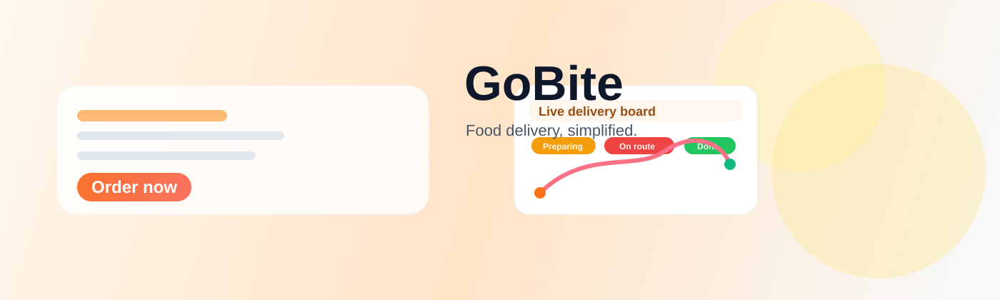

# GoBite

<div align="center">
  
</div>

<div align="center">
  
  
  
</div>

<p align="center">
  <strong>GoBite</strong> helps restaurants and customers move from craving to delivery in minutes.
</p>

Built for the next wave of local food-tech products, GoBite turns restaurant discovery, order tracking, and operations into one streamlined platform that feels premium, practical, and scalable.

## Investor Pitch

GoBite addresses a clear market need: local food delivery still suffers from fragmented ordering, weak transparency, and operational complexity. By combining a consumer ordering experience with an owner-facing fulfillment dashboard, GoBite creates a compact but powerful operating layer for small and mid-sized food businesses to compete with much larger platforms.

## Why GoBite

GoBite makes food ordering feel effortless:

- customers can discover nearby restaurants and place orders in minutes
- owners can monitor every active delivery without extra tools
- every order status stays transparent from kitchen to doorstep

## Feature Highlights

<div align="center">
  <table>
    <tr>
      <td align="center"><strong>Smart ordering</strong><br>Search, filter, and place orders in a single flow.</td>
      <td align="center"><strong>Live delivery</strong><br>Track route progress and ETA updates in real time.</td>
      <td align="center"><strong>Owner control</strong><br>Manage all active orders through a restricted admin view.</td>
    </tr>
  </table>
</div>

## How It Works

1. The customer signs up and saves a delivery location.
2. Nearby restaurants are filtered by cuisine and rating.
3. The user adds dishes to a cart and completes checkout.
4. ETA and delivery status are estimated from route distance and traffic conditions.
5. The owner logs in to view all active orders, timelines, and status updates.
6. Delivery progress is tracked visually until the order is marked complete.

## Demo Flow

1. Sign up or log in as a customer.
2. Save a delivery address to see nearby restaurants.
3. Browse restaurants, filter by cuisine, and add items to a cart.
4. Place an order with payment and ETA details.
5. Track the delivery timeline and route map.
6. Log in with the owner account to access the admin dashboard and update order status.

## Features

- Customer signup and login
- Delivery address saving with geolocation
- Restaurant search and cuisine filtering
- Menu browsing and cart management
- ETA estimation using route distance and traffic assumptions
- Live order status timeline and route tracking
- Owner-only admin dashboard with multi-order controls
- MySQL-backed persistence for orders and users

## Tech Stack

- Python
- Streamlit
- SQLAlchemy
- MySQL
- Pandas
- Requests
- python-dotenv

## Project Structure

```text
GoBite/
├── gobite/
│   ├── app.py
│   ├── README.md
│   ├── requirements.txt
│   └── .env
├── tests/
│   └── test_app_logic.py
├── .gitignore
├── README.md
├── LICENSE
└── .git
```

## Getting Started

### 1) Install dependencies

```bash
pip install -r gobite/requirements.txt
```

### 2) Configure environment variables

Create a `.env` file inside `gobite/` with:

```env
DB_HOST=your_host
DB_PORT=3306
DB_USER=your_user
DB_NAME=your_database
DB_PASSWORD=your_password
OWNER_EMAIL=owner@gobite.com
RAPIDAPI_KEY=your_key
RAPIDAPI_GEO_HOST=forward-reverse-geocoding.p.rapidapi.com
```

> The admin dashboard is restricted to the account whose email matches `OWNER_EMAIL`.

### 3) Run the app

```bash
streamlit run gobite/app.py
```

## Screenshots

Add project screenshots here as you capture them:

- Customer home and restaurant browsing
- Cart and checkout flow
- Live delivery tracking screen
- Owner admin dashboard

Example layout:

```md
## Screenshots

### Customer Flow


### Owner Admin


```

## Testing

```bash
python -m pytest -q
```

## Releases

Current release:

- v1.0.0 — initial public release of GoBite

Create a release tag locally with:

```bash
git tag -a v1.0.0 -m "GoBite v1.0.0"
git push origin v1.0.0
```

## License

This project is licensed under the MIT License. See the [LICENSE](LICENSE) file for details.

## Contributing

Pull requests are welcome. For major changes, please open an issue first to discuss the proposal.
